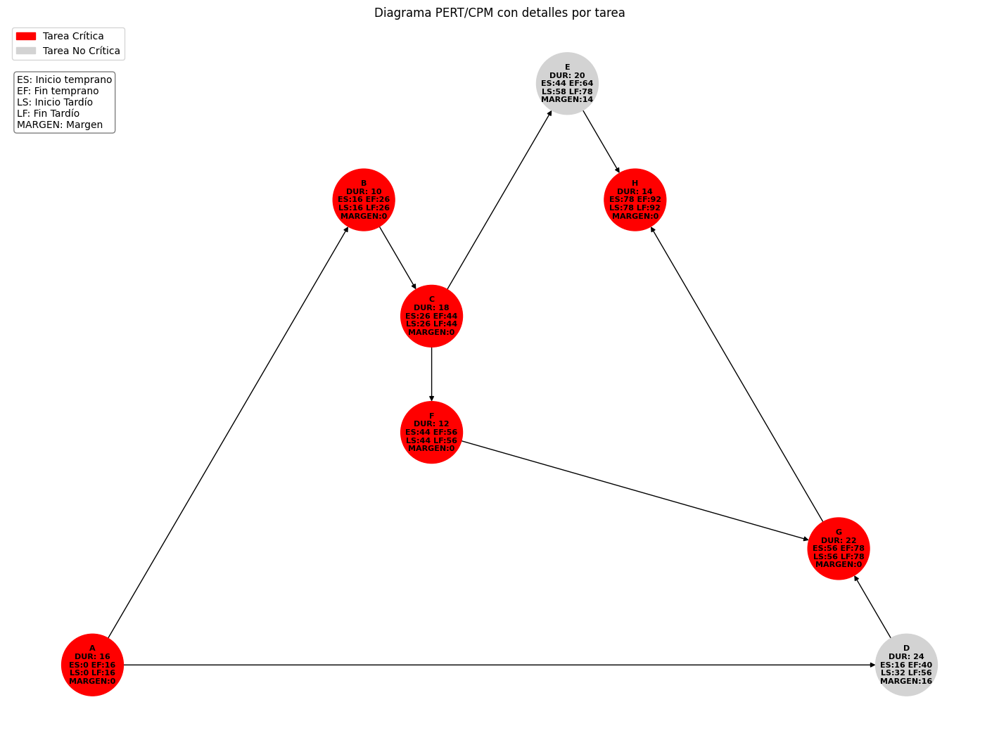

# py-pert-cpm.py

Aplicación para visualizar las rutas críticas, y como anexo, diagramar.

## Características

* Utiliza un archivo csv como base de datos donde estarán las actividades. La esctructura del archivo está definido como el siguiente ejemplo:

|CODE|DESC|DIAS|PREDECESORES|
|----|----|----|------------|
|A|Actividad 1| 1 | |
|B|Actividad 2| 3 | A |
|C|Actividad 3| 2 |AB|

* Este archivo es un CSV separado por coma (,).

## Para instalar los requerimientos simplemente ejecute
```sh
pip install -r requirements.txt
```
## Para ejecutar

Para la ejecución solo basta con las instrucciones

```sh
py py-pert-cpm.py
``` 

## Datos

Los datos se deben de incluir dentro del archivo datos.csv, en el formato que se administra la plantilla.

## Salida

Como salida esta aplicación entrega una tabla del tipo:

```bash
    DESC CODE  PRED  DIAS  ES  EF  LS  LF  MARGEN CRITICO?
0  taskA    A          16   0  16   0  16       0       SI
1  taskB    B     A    10  16  26  16  26       0       SI
2  taskC    C     B    18  26  44  26  44       0       SI
3  taskD    D     A    24  16  40  32  56      16       NO
4  taskE    E     C    20  44  64  58  78      14       NO
5  taskF    F     C    12  44  56  44  56       0       SI
6  taskG    G  D, F    22  56  78  56  78       0       SI
7  taskH    H  E, G    14  78  92  78  92       0       SI

ES: Inicio temprano
EF: Fin temprano
LF: Inicio tardío
LS: Fin tardío
```

Además, genera una imagen png diagramando la salida de esta manera:

